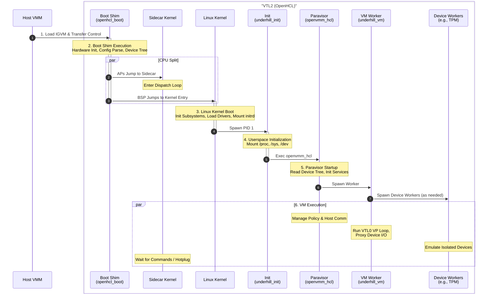

# OpenHCL Boot Flow

This page describes how the host loads OpenHCL, how `openhcl_boot` starts Linux,
and how the OpenHCL user-mode processes begin running.

## 1. IGVM Loading

The host VMM follows the directives in the OpenHCL IGVM file to populate VTL2
memory and start the boot shim. The file contains the boot shim, Linux kernel,
initial ramdisk, and other components needed by the paravisor.

The IGVM file tells the host where to load each component and which initial
state contributes to the launch measurement. The host also supplies runtime
values such as processor topology, VTL2 memory, serial configuration, and
device settings.

## 2. Boot Shim Execution (`openhcl_boot`)

The host transfers control to `openhcl_boot`, which performs these steps:

1. **Hardware initialization:** Initialize CPU state and the memory management
    unit (MMU).
2. **Configuration validation:** Validate imported regions and combine measured
    build-time parameters with the runtime data permitted by the image policy.
3. **Device tree construction:** Build the hardware topology and the set of
    devices passed to Linux.
4. **Sidecar setup (x86_64):** Assign processors to Linux or sidecar, initialize
    their control structures, and start the sidecar processors.
5. **Kernel handoff:** Start Linux with the final device tree, command line, and
    architecture-specific boot data.

### Measured and host-provided inputs

The measured IGVM fixes component addresses, imported regions, initrd metadata,
and static command-line options. At launch, the host contributes topology and
resource data. For a hardware-isolated VM, the shim filters that host data
according to the policy in the measured image before exposing it to Linux.

## 3. Linux Kernel Boot

Linux initializes memory management, scheduling, and the drivers used by the
paravisor. It mounts the initial ramdisk as its root filesystem and starts
`underhill_init` as PID 1. Sidecar CPUs remain in their dispatch loop until
Linux hot-plugs them.

## 4. Userspace Initialization (`underhill_init`)

`underhill_init` mounts the required pseudo-filesystems, configures the process
environment and system limits, and then replaces itself with
`/bin/openvmm_hcl`.

## 5. Paravisor Startup (`openvmm_hcl`)

`openvmm_hcl` reads topology and configuration from `/proc/device-tree` and
other kernel interfaces. It initializes host communication and VTL0 management,
then starts the `underhill_vm` worker.

`openvmm_hcl` remains the policy and control-plane process after spawning the
worker. See the dedicated [`openvmm_hcl`](./openvmm_hcl.md) page for its
resource, worker, servicing, and diagnostic responsibilities.

## 6. VM Execution

The `underhill_vm` process runs the VTL0 virtual processors, handles exits, and
coordinates device emulation. Devices such as the virtual TPM can run in
dedicated worker processes, with `underhill_vm` proxying their I/O and guest
memory access. `openvmm_hcl` remains responsible for policy, lifecycle, and
host communication.
